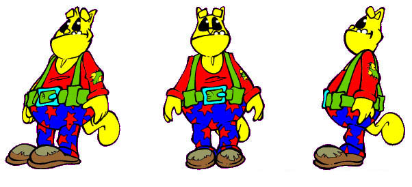

<h1 align="center">
  <br>
  
  <br>
  BUG EDITOR
  <br>
</h1>

<p align="center">
  <b>Un’opera di ANDREA ROTONDO e MARCO FEO</b><br>
  <i>Basato sul motore open-source di Wick Editor</i>
</p>

<p align="center">
  <a href="LICENSE.md">
    
  </a>
  <a href="https://wox76.github.io/bug_editor/">
    
  </a>
</p>

<p align="center">
  <a href="LICENSE.md">
    
  </a>
</p>

---

## 🎮 TESTA BUG EDITOR ONLINE

Puoi iniziare subito a creare le tue animazioni e giochi direttamente nel browser!

### 👉 **[CLICCA QUI PER GIOCARE E CREARE](https://wox76.github.io/bug_editor/)** 🚀

---

## 🐞 Cos'è BUG EDITOR?

**BUG EDITOR** è uno strumento gratuito e open-source per la creazione di giochi, animazioni e narrazioni interattive. Nato come evoluzione di **Wick Editor**, BUG è stato rifinito per offrire un’esperienza più stabile, precisa e moderna nel digital storytelling vettoriale.

Realizzato da **Andrea Rotondo** e **Marco Feo**, BUG EDITOR introduce strumenti di disegno avanzati e una stabilità del motore di rendering ottimizzata per workflow professionali.

---

## 🛠️ Caratteristiche Esclusive

Rispetto alla versione originale di Wick, BUG EDITOR introduce miglioramenti strutturali e nuovi strumenti:

*   **🖊️ Pen Tool (Shortcut 'v')**: Un nuovo strumento dedicato per la costruzione dei tracciati vertice per vertice, essenziale per il disegno tecnico e l’animazione di precisione.
*   **⛓️ Interpolazione Potenziata (Tweening)**: Corretto il bug che impediva l'aggiornamento automatico della timeline variando opacità e scala dall'Inspector. Ora le variazioni numeriche vengono registrate istantaneamente.
*   **💎 Stabilità dei Tracciati**: Hardening del codice di gestione dei nodi (`PathCursor.js`) per prevenire crash durante operazioni booleane (Union/Subtract) complesse e selezioni a scatola.
*   **🎨 UI Personalizzata**: Nuova interfaccia, nuovo logo, nuovo schema di preloader animato e splash screen dedicato.

---

## 📖 Storia e Visione

BUG EDITOR nasce dalla necessità di avere uno strumento di animazione web-based che non scendesse a compromessi con la facilità d'uso, ma che garantisse la solidità necessaria per la produzione. Andrea Rotondo e Marco Feo hanno preso il cuore pulsante di Wick Editor e lo hanno integrato con strumenti di editing vettoriale più avanzati, trasformando un ottimo progetto in uno strumento sartoriale.

### Gallery
<p align="center">
  
  
</p>
<p align="center">
  
</p>

---

## 🚀 Iniziare

Puoi usare BUG EDITOR direttamente online qui: **[BUG EDITOR ONLINE](https://wox76.github.io/bug_editor/)**.

Se vuoi eseguirlo localmente:

1. **Installa le dipendenze**:
    ```bash
    npm install
    ```
2. **Avvia in locale**:
    ```bash
    npm start
    ```
3. **Apri il browser**: Vai su `http://localhost:3000`.

---

## 📄 Licenza

BUG EDITOR è distribuito sotto licenza **GNU v3 Public License**. Vedere il file [LICENSE](LICENSE.md) per maggiori informazioni. 
Il progetto è basato su Wick Editor (Wicklets LLC).
