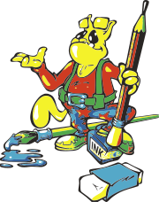
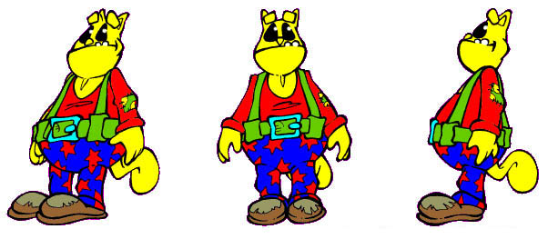

<h1 align="center">
  <br>
  
  <br>
  BUG EDITOR
  <br>
</h1>

<p align="center">
  <b>Un’opera di ANDREA ROTONDO e MARCO FEO</b><br>
  <i>Basato sul motore open-source di Wick Editor</i>
</p>

<p align="center">
  <a href="LICENSE.md">
    
  </a>
  <a href="https://wox76.github.io/bug_editor/">
    
  </a>
</p>

---

## 🎮 TESTA BUG EDITOR ONLINE

Puoi iniziare subito a creare le tue animazioni e giochi direttamente nel browser!

### 👉 **[CLICCA QUI PER GIOCARE E CREARE](https://wox76.github.io/bug_editor/)** 🚀

---

## 🐞 Cos'è BUG EDITOR?

**BUG EDITOR** è uno strumento gratuito e open-source per la creazione di giochi, animazioni e narrazioni interattive. Nato come evoluzione di **Wick Editor**, BUG è stato rifinito per offrire un’esperienza più stabile, precisa e moderna nel digital storytelling vettoriale.

Realizzato da **Andrea Rotondo** e **Marco Feo**, BUG EDITOR introduce strumenti di disegno avanzati e una stabilità del motore di rendering ottimizzata per workflow professionali.

---

## 🛠️ Caratteristiche Esclusive

Rispetto alla versione originale di Wick, BUG EDITOR introduce miglioramenti strutturali e potenti nuovi strumenti:

*   **🧲 Snap & Griglia Intelligente (Magnet Snapping)**: Nuovo popover dedicato nella barra degli strumenti con aggancio magnetico multi-livello:
    *   *Snap to Grid*: aggancio preciso a una griglia visuale regolabile.
    *   *Snap to Objects*: allineamento dinamico ai nodi, centri e bordi degli altri oggetti vettoriali.
    *   *Snap to Canvas*: allineamento immediato ai bordi e al centro del canvas.
*   **📚 Gestione Livelli Rapida (Layers Popover)**: Accesso compatto e flessibile ai livelli direttamente dalla barra superiore (in stile Procreate/Figma), con controlli per visibilità, blocco, opacità e selezione rapida degli oggetti di ciascun livello.
*   **🖼️ Vettorializzazione Immagini (Image Tracing)**: Strumento integrato per convertire immagini raster (JPG, PNG) in veri tracciati vettoriali SVG nativi Wick:
    *   *Modalità Monocromatica*: tracciamento a silhouette e contrasto con filtri rumore (speckle) e levigatezza curve.
    *   *Modalità a Colori*: posterizzazione multi-livello con palette personalizzabile e generazione di livelli cromatici separati.
*   **📑 Libreria Modelli & Flyer (Templates)**: Sezione template pronta all'uso con layout professionali (compleanni, eventi, moda, poster), dimensioni canvas automatiche, sfondi ad alta risoluzione e grafiche tipografiche preconfigurate.
*   **✍️ Tipografia & Text Editor Avanzato**: Editing in-line del testo potenziato (`TextItem.edit.js`) con supporto a Google Fonts (es. *Italiana*), gestione fine dell'interlinea (leading) e stile selettivo su porzioni di testo.
*   **🖊️ Pen Tool (Shortcut 'v') & Modifica Vertici**: Disegno vettoriale punto-a-punto con curve Bézier e supporto alla cancellazione mirata dei vertici (tasto *Canc* / *Delete* su singoli segmenti selezionati con `Pen` o `PathCursor`).
*   **🗂️ Outliner Modernizzato**: Pannello gerarchico ridisegnato con icone vettoriali chiare, indicatori di stato, ricerca rapida e gestione intuitiva della pila degli oggetti.
*   **⛓️ Interpolazione Potenziata (Tweening)**: Corretto il bug che impediva l'aggiornamento automatico della timeline variando opacità e scala dall'Inspector. Le variazioni numeriche vengono registrate istantaneamente.
*   **💎 Stabilità del Motore Vettoriale**: Hardening del codice di gestione nodi e trasformazione (`PathCursor.js`, `Paper.SelectionWidget.js`, `View.Project.js`) per prevenire crash ed errori durante selezioni multiple, trasformazioni complesse e operazioni booleane.
*   **🎨 UI Obsidian Dark & Token Moderni**: Nuova interfaccia con tema scuro ad alto contrasto, etichette intuitive *FILL* e *STROKE* nella toolbox, icone vettoriali moderne e preloader personalizzato.

---

## 📖 Storia e Visione

BUG EDITOR nasce dalla necessità di avere uno strumento di animazione web-based che non scendesse a compromessi con la facilità d'uso, ma che garantisse la solidità necessaria per la produzione. Andrea Rotondo e Marco Feo hanno preso il cuore pulsante di Wick Editor e lo hanno integrato con strumenti di editing vettoriale più avanzati, trasformando un ottimo progetto in uno strumento sartoriale.

### Gallery
<p align="center">
  
  
</p>
<p align="center">
  
</p>

---

## 🚀 Iniziare

Puoi usare BUG EDITOR direttamente online qui: **[BUG EDITOR ONLINE](https://wox76.github.io/bug_editor/)**.

Se vuoi eseguirlo localmente:

1. **Installa le dipendenze**:
    ```bash
    npm install
    ```
2. **Avvia in locale per lo sviluppo**:
    ```bash
    npm start
    ```
3. **Compila per la produzione**:
    ```bash
    npm run build
    ```
4. **Testa la build di produzione in locale**:
    ```bash
    python3 serve.py
    ```
    e apri `http://localhost:3000/bug_editor/`.

---

## 📄 Licenza

BUG EDITOR è distribuito sotto licenza **GNU v3 Public License**. Vedere il file [LICENSE](LICENSE.md) per maggiori informazioni. 
Il progetto è basato su Wick Editor (Wicklets LLC).
